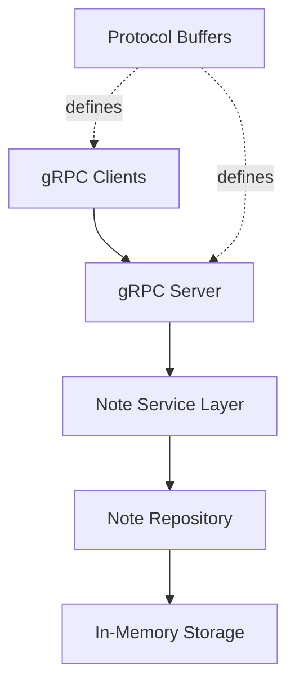

# Design Document: gRPC Note API Server

## Overview

This document outlines the design for a gRPC-based note management API server implemented in Dart. The server will use the `grpc` package for Dart to provide remote procedure call interfaces for CRUD operations on notes. The system follows a layered architecture with clear separation between the gRPC service layer, business logic, and data persistence.

## Architecture

### High-Level Architecture



### Technology Stack

- **Language**: Dart 3.x
- **gRPC Framework**: `grpc` package (^3.2.0)
- **Protocol Buffers**: `protobuf` package (^3.1.0)
- **Code Generation**: `protoc_plugin` for Dart
- **Storage**: In-memory Map (can be extended to database)
- **Concurrency**: Dart isolates and async/await patterns

### Project Structure

```
grpc-note-server/
├── protos/
│   └── note_service.proto          # Protocol Buffer definitions
├── lib/
│   ├── generated/                  # Generated gRPC/protobuf code
│   │   ├── note_service.pb.dart
│   │   ├── note_service.pbgrpc.dart
│   │   └── note_service.pbenum.dart
│   ├── models/
│   │   └── note.dart              # Note domain model
│   ├── repositories/
│   │   └── note_repository.dart   # Data access layer
│   ├── services/
│   │   └── note_service_impl.dart # gRPC service implementation
│   └── server.dart                # Server setup and configuration
├── bin/
│   └── server.dart                # Server entry point
├── pubspec.yaml                   # Dart dependencies
└── README.md                      # Setup and usage instructions
```

## Components and Interfaces

### 1. Protocol Buffer Definition

**File**: `protos/note_service.proto`

The Protocol Buffer definition includes:

- **Note message**: Contains id, title, content, createdAt, updatedAt
- **CreateNoteRequest**: Contains title and content
- **CreateNoteResponse**: Contains the created note
- **GetNoteRequest**: Contains note id
- **GetNoteResponse**: Contains the requested note
- **ListNotesRequest**: Empty (retrieves all notes)
- **ListNotesResponse**: Contains repeated notes
- **UpdateNoteRequest**: Contains id, title, and content
- **UpdateNoteResponse**: Contains the updated note
- **DeleteNoteRequest**: Contains note id
- **DeleteNoteResponse**: Contains success status
- **NoteService**: Service definition with RPC methods

### 2. Note Domain Model

**File**: `lib/models/note.dart`

```dart
class Note {
  final String id;
  final String title;
  final String content;
  final DateTime createdAt;
  final DateTime updatedAt;
  
  // Constructor, copyWith, toProto, fromProto methods
}
```

### 3. Note Repository

**File**: `lib/repositories/note_repository.dart`

Responsibilities:
- Manage note storage (in-memory Map)
- Provide CRUD operations
- Handle concurrent access with proper synchronization
- Generate unique IDs for notes

Interface:
```dart
abstract class NoteRepository {
  Future<Note> create(String title, String content);
  Future<Note?> getById(String id);
  Future<List<Note>> getAll();
  Future<Note?> update(String id, String title, String content);
  Future<bool> delete(String id);
}
```

### 4. gRPC Service Implementation

**File**: `lib/services/note_service_impl.dart`

Implements the generated `NoteServiceBase` class:
- Maps gRPC requests to repository calls
- Handles error cases and returns appropriate gRPC status codes
- Converts between domain models and Protocol Buffer messages
- Validates input data

### 5. Server Configuration

**File**: `lib/server.dart` and `bin/server.dart`

Responsibilities:
- Initialize the gRPC server
- Register the NoteService
- Configure server options (port, concurrency)
- Handle graceful shutdown

## Data Models

### Note Entity

| Field | Type | Description |
|-------|------|-------------|
| id | String | UUID v4 identifier |
| title | String | Note title (max 200 chars) |
| content | String | Note content (max 10000 chars) |
| createdAt | int64 | Unix timestamp in milliseconds |
| updatedAt | int64 | Unix timestamp in milliseconds |

### Storage Strategy

- **Phase 1**: In-memory storage using `Map<String, Note>`
- **Concurrency**: Use Dart's async/await with proper locking mechanisms
- **Future Enhancement**: Can be replaced with database (SQLite, PostgreSQL, etc.)

## Error Handling

### gRPC Status Codes

| Scenario | Status Code | Description |
|----------|-------------|-------------|
| Success | OK | Operation completed successfully |
| Note not found | NOT_FOUND | Requested note ID doesn't exist |
| Invalid input | INVALID_ARGUMENT | Empty title and content, or invalid data |
| Server error | INTERNAL | Unexpected server-side error |
| Concurrent modification | ABORTED | Conflict during concurrent update |

### Error Response Pattern

All error responses will include:
- Appropriate gRPC status code
- Descriptive error message
- Request context (when applicable)

## Testing Strategy

### Unit Tests

- **Repository Tests**: Test CRUD operations, concurrent access, edge cases
- **Service Tests**: Test gRPC service methods with mock repository
- **Model Tests**: Test domain model conversions and validations

### Integration Tests

- **End-to-End Tests**: Test complete request/response cycle using gRPC client
- **Concurrency Tests**: Test server behavior under concurrent load
- **Error Handling Tests**: Verify proper error responses for all failure scenarios

### Test Tools

- Dart's built-in `test` package
- Mock gRPC clients for integration testing
- Load testing with multiple concurrent clients

## Performance Considerations

### Scalability

- Server supports configurable number of concurrent connections
- Async/await pattern ensures non-blocking I/O
- In-memory storage provides fast access (< 1ms for operations)

### Resource Management

- Connection pooling handled by gRPC framework
- Proper cleanup of resources on server shutdown
- Memory limits for note content size

## Security Considerations

### Input Validation

- Validate note title and content length
- Sanitize input to prevent injection attacks
- Validate UUID format for note IDs

### Future Enhancements

- Add authentication/authorization (JWT tokens)
- Implement TLS/SSL for encrypted communication
- Add rate limiting per client
- Implement user-based note isolation

## Deployment

### Server Configuration

- Default port: 50051
- Configurable via environment variables
- Support for Docker containerization

### Dependencies

```yaml
dependencies:
  grpc: ^3.2.0
  protobuf: ^3.1.0
  uuid: ^4.0.0

dev_dependencies:
  grpc_tools: ^1.4.0
  test: ^1.24.0
```

## API Documentation

### RPC Methods

1. **CreateNote**: Creates a new note
   - Input: title, content
   - Output: Note with generated ID and timestamps

2. **GetNote**: Retrieves a note by ID
   - Input: note ID
   - Output: Note or NOT_FOUND error

3. **ListNotes**: Retrieves all notes
   - Input: none
   - Output: List of all notes

4. **UpdateNote**: Updates an existing note
   - Input: note ID, new title, new content
   - Output: Updated note or NOT_FOUND error

5. **DeleteNote**: Deletes a note
   - Input: note ID
   - Output: Success status or NOT_FOUND error

## Implementation Notes

- Use `protoc` compiler with Dart plugin to generate code from `.proto` files
- Follow Dart style guide and best practices
- Implement proper logging for debugging and monitoring
- Use dependency injection for testability
- Keep business logic separate from gRPC layer
